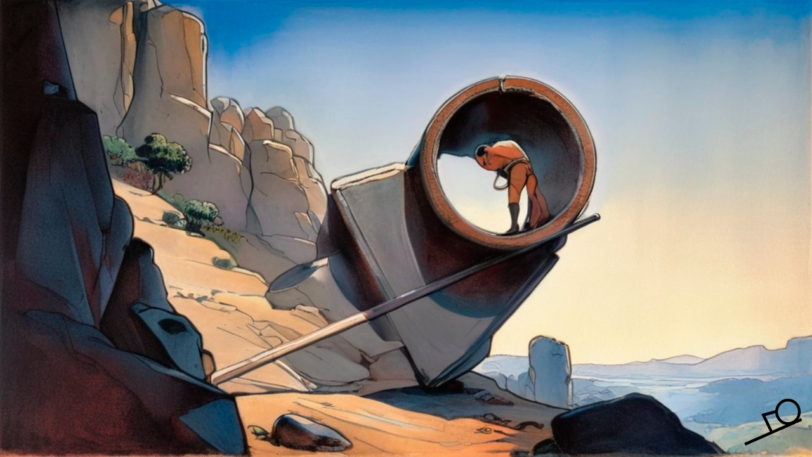
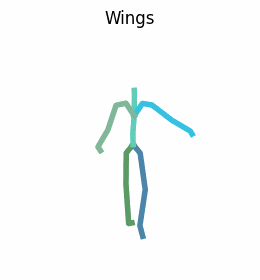
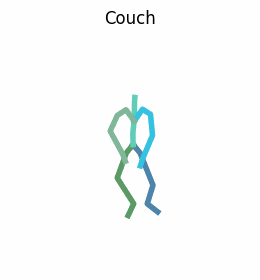
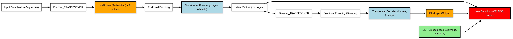

[**🇷🇺**](https://github.com/vonexel/smog/blob/master/README.md) | [**ᴇɴ**](https://github.com/vonexel/smog/blob/master/README_EN.md) 


# SMoG: Semantic Motion Generation

**S**emantic **Mo**tion **G**eneration (SMoG) — это модель для синтеза движений по тексту, использующая семантику CLIP и архитектуру Transformers с улучшением на основе сетей Колмогорова-Арнольда (KAN) для генерации реалистичных и разнообразных 3D-движений человека. В отличие от традиционных подходов, SMoG заменяет линейные слои в трансформерах на KANLayer, обеспечивая адаптивное нелинейное обучение и превосходное соответствие между текстом и движением.
Она генерирует последовательность движений 3D модели SMPL на каждом кадре.

Особенности реализации:

- синтез движений на базе CLIP для семантической согласованности текста и анимации,
- архитектура KAN-Transformer с обучаемыми сплайновыми функциями активации (B-сплайны) вместо линейных слоев MLP,
- поддержка генерации движений для различных сценариев (танцы, спорт, повседневная активность) по свободным текстовым описаниям,
- совместимость с CPU и GPU (на GPU значительно быстрее).


## Примеры:






## Обновления
01.05.25 — Исправление работы на GPU, фиксация генерируемых изображений


27.03.25 — Релиз

## Структура проекта

-----------------
📁 **smog/**  
├─ 📁 **assets/** — вспомогательные файлы для тестирования и демонстрации.  

├─ 📁 **data/** — данные и скрипты для их обработки.  
│  └─ 📁 amass_db/ — обработанные данные AMASS в формате npz.

├─ 📁 **exps/** — сохранённые модели и эксперименты.  
│  └─ 📁 my-paper-model/ — модель и ее чекпоинты.

├─ 📁 **models/** — файлы моделей SMPL и SMPL+H.

│  └─ 📁 smpl/ - 3D модель.

├─ 📁 **prepare/** — скрипт для загрузки SMPL и SMPL+H.

├─ 📁 **src/** — исходный код проекта.  

│  ├─ 📁 datasets/ — скрипты для обработки и загрузки данных (парсинг файлов .npz).

│  ├─ 📁 models / — архитектуры моделей. 

│  │  ├─ 📁 architectures / transformers + kan

│  │  ├─ 📁 modeltype / clip

│  │  ├─ 📁 tools / вспомогательные функции.

│  ├─ 📁 parser/ —  обработка аргументов командной строки.

│  ├─ 📁 train/ — основной цикл обучения (с возможностью дообучения).

│  ├─ 📁 utils/ — вспомогательные функции (например, классификация действий, создание gif-анимации).

│  └─ 📁 visualize/ — скрипты для визуализации работы модели.

│  ├─ 🐍 __init__.py 

│  └─ 🐍 config.py

├─ 📁 **visuals/** — изображения для проекта.

├─ 📄 **download_smpl_files.sh** — загрузка файлов модели SMPL (дубль **prepare/**).  
├─ 📄 **environment.yml** — описание зависимостей для создания окружения Conda.  
├─ 📄 **README.md** — описание проекта и инструкции по использованию на русском языке.  
└─ 📄 **README_EN.md** — описание проекта и инструкции по использованию на английском языке.

-----------------

## Датасет


-----------------
Набор данных **[AMASS](https://amass.is.tue.mpg.de)** (Archive of Motion Capture as Surface Shapes) представляет собой важнейший ресурс для исследователей и разработчиков в области анимации, биомеханики и машинного обучения, объединяющий данные захвата движений из различных академических источников для обеспечения широкого спектра записанных действий - от ходьбы до сложных жестов. 

Датасет фиксирует 3D-координаты суставов с помощью передовых технологий отслеживания движений, сохраняя временные последовательности, где каждая строка представляет собой временную метку, а столбцы - подробные координаты x, y, z для суставов тела, отформатированные в npz (стандартный формат для сохранения на диск нескольких массивов NumPy. Файл в этом формате — это zip-файл, содержащий несколько файлов .npy, по одному для каждого массива) для эффективной работы с большими объемами данных.

Примечательно, что в AMASS интегрированы метки действий, антропометрические параметры и синхронизированные данные датчиков, что позволяет проводить детальные биомеханические исследования и обучать модели глубокого обучения, такие как LSTM или Transformers, для предсказания позиционирования трехмерного меша.
Еще одной критической особенностью данных является то, что они крайне масштабируемы,так как он охватывает десятки тысяч движений.

Лицензия AMASS определена для академических исследований, допуская некоммерческое использование с указанием авторства, в то время как для коммерческих приложений требуется явное разрешение.
АМАСС сопровождается инструментами визуализации и примерами кода,обеспечивая исследователям возможность использовать его потенциал без ущерба для анонимности участников.

## SMoG Model





В основе SMoG лежит MotionCLIP – 3D-автокодер движений, обученный воссоздавать образы с помощью естественного языка. Задействуется скрытое пространство (latent space), относящееся к абстрактному, но сжатому представлению особенностей (признаков) данных, нетривиально присутствующих во входном пространстве. Если попытаться визуализировать latent space, то оно будет представлять собой набор точек, расположенных ближе друг к другу. Важно обратить внимание на то, что это позволяет в некоторой степени отказаться от классической разметки данных, так как в данном методе используется подход контрастивного обучения, направленный на подготовку к способности различать приближение, тождественность или различие между определенными текстами и движениями. В процессе обучения, пары действия и текста сопоставляются на наличие сходства (положительные), либо несходные (негативные). Основополагающим стремлением является максимизация сходства между векторами позитивных пар и минимизация между негативными.

Именно скрытое пространство призвано осуществить семантическое выравнивание между вводимым текстом и генерируемым движением, что приводит к более осмысленному процессу интерпретации. Например, введя произвольное описание, допустим, "крылья" или отметив культурную ссылку, возможно получить несущее смысл движение, осознанное, в рамках контекста: взмах руками, имитирующий взмахи крыльев, без явного представления примеров в тренировочных данных.

MotionCLIP — это инновационная нейросетевая модель, предназначенная для генерации реалистичных 3D-человеческих движений на основе семантических текстовых описаний. Её работа основывается на комбинации автокодировщика движения и пространства CLIP (Contrastive Language-Image Pretraining), что позволяет связывать текстовые метки с визуальными паттернами движений. Рассмотрим ключевые аспекты её функционирования подробнее.


SMoG состоит из:

1. Автокодировщика на базе Transformers (с добавлением KANLayer вместо линейных слоев):

    - энкодера, преобразующего входные данные о движении (например, позы скелета в 3D-пространстве) в латентное представление;
    - декодера, восстанавливающего исходное движение из латентного вектора.
    - интеграция KANLayer в автокодировщик, взамен стандартным линейным слоям.

Трансформеры эффективны для захвата долгосрочных зависимостей в данных, что критично для моделирования динамики человеческих движений, где временная согласованность - базис.

2. Выравнивание с CLIP-пространством:

    - модель обучается не только на реконструкцию движений, но и на выравнивание их латентных представлений с текстовыми метками в CLIP-пространстве 

3. KAN-слой:


`KANLayer`, являющийся ключевым элементом архитектуры Kolmogorov–Arnold Networks (KAN), реализует гибридный подход к аппроксимации функций, основанный на теореме Колмогорова-Арнольда, утверждающей, что любую многомерную непрерывную функцию можно представить как суперпозицию одномерных функций, что в KANLayer достигается через комбинацию линейных преобразований и нелинейных B-сплайновых компонентов. Структурно слой состоит из двух параллельных ветвей: базовой , выполняющей линейное преобразование с активацией (по умолчанию — SiLU), и сплайновой , добавляющей нелинейность через адаптивные B-сплайны.

Сплайновая ветвь оперирует коэффициентами `spline_weight`, которые вычисляются путем интерполяции B-сплайнов на фиксированной сетке grid, разбивающей входной диапазон (например, [-1, 1]) на grid_size интервалов. Порядок сплайна (`spline_order`) определяет их гладкость и сложность, а метод `b_splines` реализует рекурсивную формулу Кокса-де Бора для построения базисных функций.

Инициализация сплайновых весов включает добавление шума (scale_noise) и решение задачи наименьших квадратов в методе `curve2coeff`, что позволяет приблизить начальные значения к заданным точкам функции. Для повышения устойчивости обучения параметр `enable_standalone_scale_spline` позволяет независимо масштабировать сплайновые коэффициенты через `spline_scaler`.
Во время прямого прохода входные данные обрабатываются обеими ветвями: базовая генерирует линейный выход через активацию и матричное умножение, а сплайновая вычисляет нелинейное смещение, сворачивая B-сплайны с обучаемыми весами. Таким образом, результаты суммируются, формируя выходной тензор.

## Как запустить проект
### 1. Клонируем проект из удаленного репозитория

```
git clone https://github.com/vonexel/smog.git
cd ./smog
```

### 2. Создадим conda среду

```
conda env create -f environment.yml
conda activate smog
```

Протестировано на Python 3.9 и PyTorch 2.2.2.

### 3. Загрузим данные

**Загрузка спарсенных данных (разделенных на train, test, validation)**

[Parsed AMASS dataset](https://drive.google.com/drive/folders/1U_AdhZMo4hYlXkCdHD0P1aSkQNbr0tXm?usp=sharing) -> `./data/amass_db`


### 4. Загрузим SMPL 3D-модель

```bash
bash prepare/download_smpl_files.sh
```
Данный скрипт загрузит SMPL модель из [**репозитория**](https://github.com/classner/up/blob/master/models/3D/basicModel_neutral_lbs_10_207_0_v1.0.0.pkl) вместе с дополнительными файлами.

Расширенная модель SMPL+H доступна на [MANO](https://mano.is.tue.mpg.de/), поместите файлы в `./models/smplh`.


### 5. Обучение

```bash
python -m src.train.train --clip_text_losses cosine --clip_image_losses cosine --pose_rep rot6d --lambda_vel 100 --lambda_rc 100 --lambda_rcxyz 100 --jointstype vertices --batch_size 64 --num_frames 30 --num_layers 4 --lr 0.0001 --glob --translation --no-vertstrans --latent_dim 256 --num_epochs 2 --snapshot 10 --device 0 --dataset amass --datapath ./data/amass_db --folder ./exps/my-paper-model
```

Для использования собственных текстов (используйте `paper_texts.txt` в качестве примера) укажите файл через `--input_file` (формат: одна строка — один запрос).

## Особенности
### Введение KAN-слоев с B-сплайнами

```
class KANLayer(nn.Module):
    def init(self, in_features, out_features, grid_size=5, spline_order=3, ...):
        ...
        self.spline_weight = nn.Parameter(torch.Tensor(out_features, in_features, grid_size + spline_order))
        ...
    def forward(self, x):
        ...
        bspline = self.b_splines(x_flat)
        spline_output = F.linear(bspline, self.scaled_spline_weight)
        output = base_output + spline_output
        ...
```

- Адаптивная нелинейность через B-сплайны: 

В отличие от стандартных линейных слоев или активаций (ReLu, GELU), KANLayer использует B-сплайны для создания гладких, параметризуемых нелинейных преобразований. Это позволяет модели адаптироваться к сложным паттернам движения, улучшая аппроксимацию функций.
- Комбинация линейных и сплайновых весов:

Слой объединяет базовую линейную трансформацию (`base_weight`) и сплайновое смещение (`spline_weight`), что повышает выразительность модели без значительного увеличения числа параметров.
- Инициализация через задачу наименьших квадратов:

Метод `curve2coeff` инициализирует сплайн-веса, минимизируя ошибку интерполяции, что стабилизирует обучение на ранних этапах.


По итогу, KAN-слои улучшают способность модели к захвату динамики движений (например, плавных переходов между позами), что критично для задач анимации. Это особенно заметно в `skelEmbedding` энкодера, где входные данные сжимаются в латентное пространство с учётом скелетной структуры.


## Источники
1. [Learning Transferable Visual Models From Natural Language Supervision](https://arxiv.org/abs/2103.00020)
2. [OpenAI CLIP simple implementation](https://www.kaggle.com/code/moeinshariatnia/openai-clip-simple-implementation)
3. [MotionCLIP](https://arxiv.org/abs/2203.08063)
4. [AMASS: Archive of Motion Capture As Surface Shapes](https://amass.is.tue.mpg.de)
5. [KAN: Kolmogorov-Arnold Networks](https://arxiv.org/abs/2404.19756)
6. [KAN or MLP: A Fairer Comparison](https://arxiv.org/abs/2407.16674)
7. [An Efficient Implementation of Kolmogorov-Arnold Network](https://github.com/Blealtan/efficient-kan)


## Благодарность

Код трансформера и загрузчика данных основан на репозитории [ACTOR](https://github.com/Mathux/ACTOR). 

## Лицензия
Код распространяется под лицензией [MIT LICENSE](LICENSE).

Обратите внимание, что используемые библиотеки CLIP, SMPL, SMPL-X, PyTorch3D, MotionCLIP и датасет имеют собственные лицензии, которые необходимо соблюдать.

