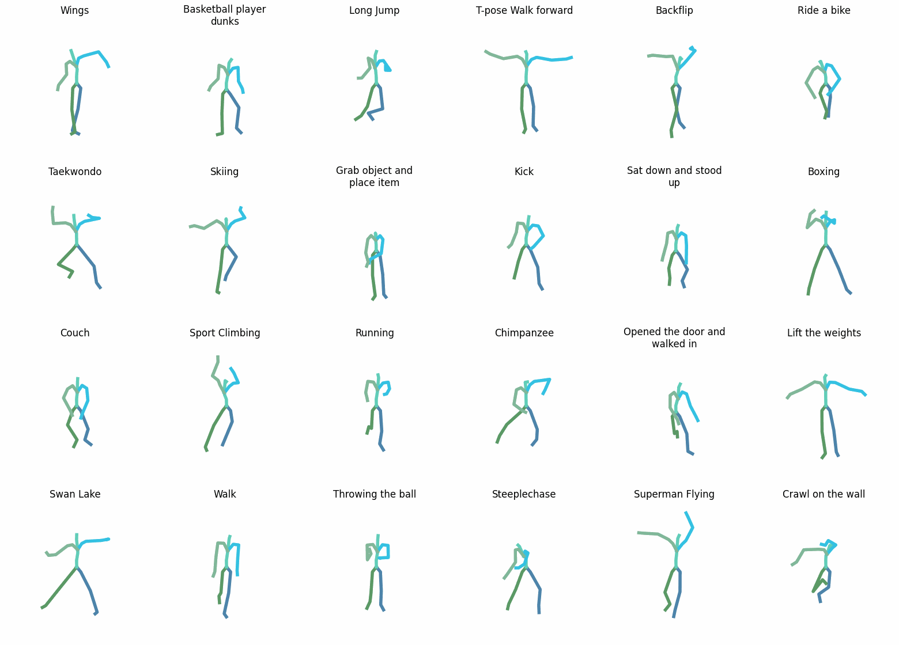

[**🇷🇺**](https://github.com/vonexel/smog/blob/master/README.md) | [**ᴇɴ**](https://github.com/vonexel/smog/blob/master/README_EN.md) 


# SMoG: Semantic Motion Generation

**S**emantic **Mo**tion **G**eneration (SMoG) is a state-of-the-art text-to-motion synthesis model that leverages CLIP semantics and Kolmogorov-Arnold Network (KAN)-enhanced transformers to generate realistic, diverse 3D human motions from textual descriptions. Unlike conventional approaches, SMoG replaces linear layers in transformer architectures with KANLayers, enabling adaptive nonlinear feature learning and superior motion-text alignment.
It generates the sequence of SMPL body model movement for each frame.

This implementation:

- CLIP-driven motion synthesis for semantically coherent text-to-animation generation,
- KAN-Transformer architecture with trainable spline-based (b-splines) activation functions instead of MLP's linear layers,
- support for multi-scenario motion generation (e.g., dances, sports, daily activities) from free-form text prompts,
- supports both CPU and GPU inference (though GPU is way faster).


## Results:




## Updates
**01/MAY/25** - Fix of GPU-support, fix of visualization issue.


**27/MARCH/25** - First release.

## Project structure

-----------------
📁 **smog/**  
├─ 📁 **assets/** — Auxiliary files for testing and demonstration.  

├─ 📁 **data/** — Data and processing scripts.
│  └─ 📁 amass_db/ — Processed AMASS data in npz format.

├─ 📁 **exps/** — Models and experiments.  
│  └─ 📁 my-paper-model/ — Model and checkpoints.

├─ 📁 **models/** — SMPL and SMPL+H model files.

│  └─ 📁 smpl/ - 3D model.

├─ 📁 **prepare/** — Script for downloading SMPL and SMPL+H.

├─ 📁 **src/** — Project source code..  

│  ├─ 📁 datasets/ — Scripts for data processing and loading (.npz parsing).

│  ├─ 📁 models / — Model architectures. 

│  │  ├─ 📁 architectures / Transformers + KAN

│  │  ├─ 📁 modeltype / CLIP

│  │  ├─ 📁 tools / Utility functions.

│  ├─ 📁 parser/ —  Command-line argument processing.

│  ├─ 📁 train/ — Main training loop (with fine-tuning option).

│  ├─ 📁 utils/ — Utilities (e.g., action classification, GIF of animation creation).

│  └─ 📁 visualize/ — Visualization scripts.

│  ├─ 🐍 __init__.py 

│  └─ 🐍 config.py

├─ 📁 **visuals/** — Project images.

├─ 📄 **download_smpl_files.sh** — SMPL model file download script (duplicate of **prepare/** ).  
├─ 📄 **environment.yml** — Conda environment dependencies.  
├─ 📄 **README.md** — Project description and usage instructions in Russian.  
└─ 📄 **README_EN.md** — Project description and usage instructions in English.

-----------------

## Dataset


-----------------

The **[AMASS](https://amass.is.tue.mpg.de) dataset** (Archive of Motion Capture as Surface Shapes) is a critical resource for researchers and developers in animation, biomechanics, and machine learning, aggregating motion capture data from academic sources to cover diverse actions—from walking to complex gestures.

The dataset records 3D joint coordinates using advanced motion-tracking technologies, preserving temporal sequences where each row represents a timestamp and columns store detailed x, y, z coordinates for body joints, formatted in npz (a standard format for storing multiple NumPy arrays on disk as a ZIP file containing .npy files).

Notably, AMASS integrates action labels, anthropometric parameters, and synchronized sensor data, enabling detailed biomechanical studies and training deep learning models (e.g., LSTMs, Transformers) for 3D mesh pose prediction.
A key feature is its scalability, encompassing tens of thousands of motions.

AMASS is licensed for academic research, permitting non-commercial use with attribution, while commercial applications require explicit permission.
The dataset is accompanied by visualization tools and code examples, allowing researchers to utilize its potential while preserving participant anonymity.

## SMoG Model


 

SMoG is built on MotionCLIP — a 3D motion autoencoder trained to reconstruct poses using natural language. It employs a latent space representing abstract, compressed data features non-trivially present in the input space. Visualizing the latent space reveals points clustered by similarity. This approach reduces reliance on classical data labeling by using contrastive learning to distinguish similarity, identity, or difference between text-motion pairs. During training, action-text pairs are matched for similarity (positive) or dissimilarity (negative), maximizing positive pair similarity and minimizing negative pair similarity.

The latent space enables semantic alignment between input text and generated motion, producing meaningful interpretations. For example, inputting "wings" or a cultural reference could generate a wing-like arm motion without explicit training examples.

MotionCLIP is an innovative neural network model for generating realistic 3D human motions from semantic text descriptions, combining a motion autoencoder with CLIP (Contrastive Language-Image Pretraining) space alignment. Key components:

SMoG:

1. Transformer-based autoencoder (with KANLayers replacing linear layers):

   - Encoder: Converts motion data (e.g., 3D skeleton poses) into latent representations.
   - Decoder: Reconstructs original motion from latent vectors.
   - KANLayer integration replaces standard linear layers.
   
Transformers excel at capturing long-term dependencies, critical for modeling human motion dynamics where temporal coherence is foundational.
   
2. CLIP-space alignment:
   
   - The model is trained not only to reconstruct motions but also to align their latent representations with text labels in CLIP space.
      
3. KANLayer:

The `KANLayer`, core to Kolmogorov–Arnold Networks (KAN), implements a hybrid function approximation approach based on the Kolmogorov-Arnold theorem. This theorem states that any multivariate continuous function can be represented as a superposition of univariate functions, achieved in KANLayer via linear transformations and nonlinear B-spline components. Structurally, the layer has two parallel branches: a base branch performing linear transformation with activation (default: SiLU), and a spline branch adding nonlinearity through adaptive B-splines.

The spline branch operates on coefficients `spline_weight`, computed via B-spline interpolation on a fixed grid dividing the input range (e.g., [-1, 1]) into grid_size intervals. The spline order (`spline_order`) determines smoothness and complexity. The `b_splines` method implements the recursive Cox-de Boor formula for basis functions.

Spline weight initialization includes noise addition (scale_noise) and least-squares solving in `curve2coeff` to approximate initial weights. The `enable_standalone_scale_spline` parameter allows independent scaling of spline coefficients via `spline_scaler` for training stability.
During the forward pass, inputs are processed by both branches: the base branch generates linear output via activation and matrix multiplication, while the spline branch computes nonlinear offsets via B-spline convolution with trainable weights. Outputs are summed to form the final tensor.

## Usage
### 1. Clone the project from the remote repository

```
git clone https://github.com/vonexel/smog.git
cd ./smog
```

### 2. Create conda environment

```
conda env create -f environment.yml
conda activate smog
```

The code was tested on Python 3.9 and PyTorch 2.2.2.

### 3. Download data

**Download the parsed data directly**

[Parsed AMASS dataset](https://drive.google.com/drive/folders/1U_AdhZMo4hYlXkCdHD0P1aSkQNbr0tXm?usp=sharing) -> `./data/amass_db`


### 4. Download the SMPL body model

```bash
bash prepare/download_smpl_files.sh
```
This will download the SMPL neutral model from this [**github repo**](https://github.com/classner/up/blob/master/models/3D/basicModel_neutral_lbs_10_207_0_v1.0.0.pkl) and additionnal files.

In addition, download the **Extended SMPL+H model** (used in AMASS project) from [MANO](https://mano.is.tue.mpg.de/), and place it in `./models/smplh`.


### 5. Training

```bash
python -m src.train.train --clip_text_losses cosine --clip_image_losses cosine --pose_rep rot6d --lambda_vel 100 --lambda_rc 100 --lambda_rcxyz 100 --jointstype vertices --batch_size 64 --num_frames 30 --num_layers 4 --lr 0.0001 --glob --translation --no-vertstrans --latent_dim 256 --num_epochs 2 --snapshot 10 --device 0 --dataset amass --datapath ./data/amass_db --folder ./exps/my-paper-model
```

To run SMoG with your own texts, create a text file, with each line depicts a different text input (see `paper_texts.txt` as a reference) and point to it with `--input_file` instead.

## Key Feature
### KAN Layers with B-splines

```
class KANLayer(nn.Module):
    def init(self, in_features, out_features, grid_size=5, spline_order=3, ...):
        ...
        self.spline_weight = nn.Parameter(torch.Tensor(out_features, in_features, grid_size + spline_order))
        ...
    def forward(self, x):
        ...
        bspline = self.b_splines(x_flat)
        spline_output = F.linear(bspline, self.scaled_spline_weight)
        output = base_output + spline_output
        ...
```

- Adaptive nonlinearity through B-splines :

Unlike standard linear layers or activations (ReLU, GELU), KANLayer uses B-splines for smooth, parameterized nonlinear transformations, improving complex motion pattern approximation.

- Combined linear and spline weights :

The layer merges base linear transformation (`base_weight`) and spline offset (`spline_weight`), enhancing expressiveness without significant parameter growth.

- Least-squares initialization :

The `curve2coeff` method initializes spline weights by minimizing interpolation error, stabilizing early training.


KANLayers improve motion dynamics capture (e.g., smooth pose transitions), critical for animation tasks, particularly in the encoder's `skelEmbedding` for latent space compression with skeletal structure awareness.


## References 
1. [Learning Transferable Visual Models From Natural Language Supervision](https://arxiv.org/abs/2103.00020)
2. [OpenAI CLIP simple implementation](https://www.kaggle.com/code/moeinshariatnia/openai-clip-simple-implementation)
3. [MotionCLIP](https://arxiv.org/abs/2203.08063)
4. [AMASS: Archive of Motion Capture As Surface Shapes](https://amass.is.tue.mpg.de)
5. [KAN: Kolmogorov-Arnold Networks](https://arxiv.org/abs/2404.19756)
6. [KAN or MLP: A Fairer Comparison](https://arxiv.org/abs/2407.16674)
7. [An Efficient Implementation of Kolmogorov-Arnold Network](https://github.com/Blealtan/efficient-kan)


## Acknowledgment

The code of the transformer model and the dataloader are based on [ACTOR](https://github.com/Mathux/ACTOR) repository. 

## License
This code is distributed under an [MIT LICENSE](LICENSE).

Note that our code depends on other libraries, including CLIP, SMPL, SMPL-X, PyTorch3D, MotionCLIP and uses datasets which each have their own respective licenses that must also be followed.
