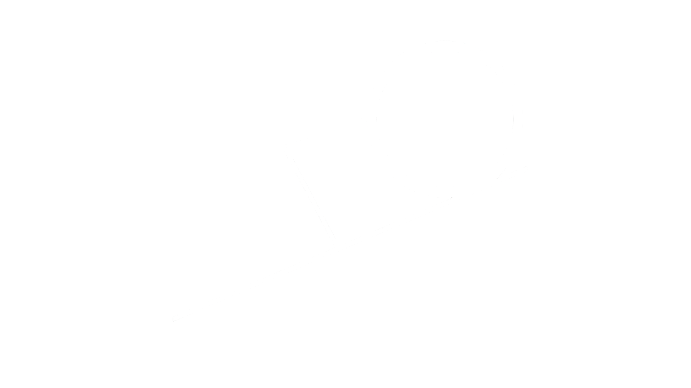
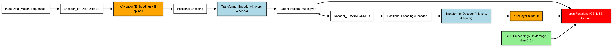
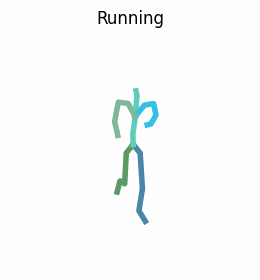
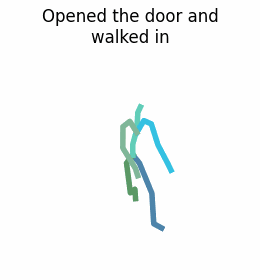
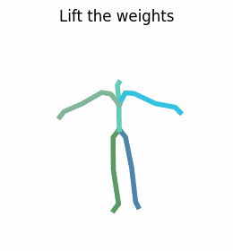

<div align="center">
  <table>
    <tr>
      <td></td>
      <td><h1>Semantic Motion Generation (SMoG): <br>A PyTorch Implementation</h1></td>
    </tr>
  </table>
</div>

<p align="center">
<a href="https://huggingface.co/vonexel/smog" alt="Hugging Face">
    </a>
      <a href="https://wandb.ai/vonexel0/smog"></a>
  <a href="https://github.com/vonexel/smog/blob/master/LICENSE"></a>
</p>


<div align="center">

# 🚶 

</div>

**S**emantic **Mo**tion **G**eneration (SMoG) is a state-of-the-art text-to-motion synthesis model that leverages CLIP semantics and Kolmogorov-Arnold Network (KAN)-enhanced transformers to generate realistic, diverse 3D human motions from textual descriptions. Unlike conventional approaches, SMoG replaces linear layers in transformer architectures with KANLayers, enabling adaptive nonlinear feature learning and superior motion-text alignment.
It generates the sequence of SMPL body model movement for each frame.

This implementation:

- CLIP-driven motion synthesis for semantically coherent text-to-animation generation;
- KAN-Transformer architecture with trainable spline-based (b-splines) activation functions instead of MLP's linear layers;
- support for multi-scenario motion generation (e.g., dances, sports, daily activities) from free-form text prompts;
- supports both CPU and GPU inference (though GPU is way faster).

<div align="center">

## Results


</div>


## 💡 Future Work

[x] Release checkpoints

[ ] Add Hydra Configuration (discard argparse)


## 📁 Project Structure

```
smog/
├── assets/                      # Auxiliary files for testing and demonstration
├── data/                        # Data and processing scripts (AMASS Dataset in .pt and .npy formats)
├── exps/                        # 🔥 Models and experiments
├── models/                      # SMPL and SMPL+H model files
├── prepare/                     # Script for downloading SMPL and SMPL+H
├── src/                         # Project source code
    ├── datasets/                # Scripts for data processing and loading (.npz parsing)
    ├── models/                  # Model architectures
        ├── architectures/       # Transformers + KAN
        ├── modeltype/           # CLIP
        ├── tools/               # Utility functions 
    ├── parser/                  # Command-line argument processing
    ├── train/                   # Main training loop (with fine-tuning option)
    ├── utils/                   # Utilities (e.g., action generation, GIF of animation creation)
    ├── visualize/               # Visualization scripts (Rendering)
    ├── __init__.py              
    ├── config.py                # Joints and it's group routing 
├── visuals/                     # Project images
├── evaluate_model.py            # 🐍 Model evaluation metrics with wandb logging
├── download_smpl_files.sh       # SMPL model file download script (duplicate of prepare/)
├── environment.yml              # ♻️ Conda environment dependencies
├── README.md                    # Project description and usage instructions in Russian
├── README_EN.md                 # Project description and usage instructions in English
```


## 🛢️ Dataset

-----------------


-----------------

The **[AMASS](https://amass.is.tue.mpg.de) dataset** (Archive of Motion Capture as Surface Shapes) is a critical resource for researchers and developers in animation, biomechanics, and machine learning, aggregating motion capture data from academic sources to cover diverse actions—from walking to complex gestures.

The dataset records 3D joint coordinates using advanced motion-tracking technologies, preserving temporal sequences where each row represents a timestamp and columns store detailed x, y, z coordinates for body joints, formatted in npz (a standard format for storing multiple NumPy arrays on disk as a ZIP file containing .npy files).

Notably, AMASS integrates action labels, anthropometric parameters, and synchronized sensor data, enabling detailed biomechanical studies and training deep learning models (e.g., LSTMs, Transformers) for 3D mesh pose prediction.
A key feature is its scalability, encompassing tens of thousands of motions.

AMASS is licensed for academic research, permitting non-commercial use with attribution, while commercial applications require explicit permission.
The dataset is accompanied by visualization tools and code examples, allowing researchers to utilize its potential while preserving participant anonymity.


## 🚶 SMoG Model



 

**SMoG** is built on MotionCLIP — a 3D motion autoencoder trained to reconstruct poses using natural language. It employs a latent space representing abstract, compressed data features non-trivially present in the input space. Visualizing the latent space reveals points clustered by similarity. This approach reduces reliance on classical data labeling by using contrastive learning to distinguish similarity, identity, or difference between text-motion pairs. During training, action-text pairs are matched for similarity (positive) or dissimilarity (negative), maximizing positive pair similarity and minimizing negative pair similarity.

The latent space enables semantic alignment between input text and generated motion, producing meaningful interpretations. For example, inputting "wings" or a cultural reference could generate a wing-like arm motion without explicit training examples.

MotionCLIP is an innovative neural network model for generating realistic 3D human motions from semantic text descriptions, combining a motion autoencoder with CLIP (Contrastive Language-Image Pretraining) space alignment. Key components:

SMoG:

1. Transformer-based autoencoder (with KANLayers replacing linear layers):

   - Encoder: Converts motion data (e.g., 3D skeleton poses) into latent representations.
   - Decoder: Reconstructs original motion from latent vectors.
   - KANLayer integration replaces standard linear layers.
   
Transformers excel at capturing long-term dependencies, critical for modeling human motion dynamics where temporal coherence is foundational.
   
2. CLIP-space alignment:
   
The model is trained not only to reconstruct motions but also to align their latent representations with text labels in CLIP space.
      
3. KANLayer:

The `KANLayer`, core to Kolmogorov–Arnold Networks (KAN), implements a hybrid function approximation approach based on the Kolmogorov-Arnold theorem. This theorem states that any multivariate continuous function can be represented as a superposition of univariate functions, achieved in KANLayer via linear transformations and nonlinear B-spline components. Structurally, the layer has two parallel branches: a base branch performing linear transformation with activation (default: SiLU), and a spline branch adding nonlinearity through adaptive B-splines.

The spline branch operates on coefficients `spline_weight`, computed via B-spline interpolation on a fixed grid dividing the input range (e.g., [-1, 1]) into grid_size intervals. The spline order (`spline_order`) determines smoothness and complexity. The `b_splines` method implements the recursive Cox-de Boor formula for basis functions.

Spline weight initialization includes noise addition (scale_noise) and least-squares solving in `curve2coeff` to approximate initial weights. The `enable_standalone_scale_spline` parameter allows independent scaling of spline coefficients via `spline_scaler` for training stability.
During the forward pass, inputs are processed by both branches: the base branch generates linear output via activation and matrix multiplication, while the spline branch computes nonlinear offsets via B-spline convolution with trainable weights. Outputs are summed to form the final tensor.

## 🗃️ Examples

|                               Wings                                |                              Swan Lake                               |                                                                     Running                                                                      | Opened the door and walked in                                                                                                          | Lift the weights                                                  |
|:------------------------------------------------------------------:|:--------------------------------------------------------------------:|:------------------------------------------------------------------------------------------------------------------------------------------------:|----------------------------------------------------------------------------------------------------------------------------------------|-------------------------------------------------------------------|
|   |    |   |   |  |


# Usage

## 🐍 Setup with Anaconda or Miniconda

This code was tested on `Ubuntu 24.04 CUDA 12.8` + `Python 3.8.11` + `PyTorch 2.4.1+cu118` 

It's recommended to use this **[conda environment](https://github.com/vonexel/smog/blob/master/environment.yml)** to avoid potential issues, particularly on Windows systems where conflicts between libraries of the same versions may arise due to differences in system-specific dependencies and binary compatibility.

```bash
# Clone repo
git clone https://github.com/vonexel/smog.git

# Go to repo directory
cd ./smog

# Create and activate conda environment
conda env create -f environment.yml
conda activate smog
```

## 🚀 Getting Started

1. **Download the parsed data directly**

[Parsed AMASS dataset](https://drive.google.com/drive/folders/1U_AdhZMo4hYlXkCdHD0P1aSkQNbr0tXm?usp=sharing) -> `./data/amass_db`

<details>
  <summary><b>If you prefer to parse the data yourself, follow this:</b></summary>

  Download and unzip the above datasets and place them correspondingly:
* [AMASS](https://amass.is.tue.mpg.de/) -> `./data/amass` (Download the SMPL+H version for each dataset separately, please note to download ALL the dataset in AMASS website)
* [BABEL](https://babel.is.tue.mpg.de/) -> `./data/babel_v1.0_release`
* [Rendered AMASS images](https://drive.google.com/file/d/1F8VLY4AC2XPaV3DqKZefQJNWn4KY2z_c/view?usp=sharing) -> `./data/render`

  Then, process the three datasets into a unified dataset with `(text, image, motion)` triplets:

To parse acording to the AMASS split (for all applications except action recognition), run:
```bash
python -m src.datasets.amass_parser --dataset_name amass
```
</details>


2. **Download the SMPL body model**
```bash
bash prepare/download_smpl_files.sh
```
This will download the SMPL neutral model from this [**github repo**](https://github.com/classner/up/blob/master/models/3D/basicModel_neutral_lbs_10_207_0_v1.0.0.pkl) and additionnal files.

In addition, download the **Extended SMPL+H model** (used in AMASS project) from [MANO](https://mano.is.tue.mpg.de/), and place it in `./models/smplh`.

3. **Train the model**
```
python -m src.train.train --clip_text_losses cosine --clip_image_losses cosine --pose_rep rot6d \
--lambda_vel 100 --lambda_rc 100 --lambda_rcxyz 100 \
--jointstype vertices --batch_size 20 --num_frames 60 --num_layers 8 \
--lr 0.0001 --glob --translation --no-vertstrans --latent_dim 512 --num_epochs 100 --snapshot 10 \
--device <GPU DEVICE ID> \
--dataset amass \
--datapath ./data/amass_db/amass_30fps_db.pt \
--folder ./exps/smog
```
> 📌 Trained models will be saved to `exp/smog/checkpoint_0000.pth.tar` and training logs are saved to `exps/smog/training.txt`

4. **Motion Generation**
```
python -m src.visualize.text2motion ./exps/smog/checkpoint_0100.pth.tar --input_file assets/paper_texts.txt
```
> 📌 To run SMoG with your own texts, create a text file, with each line depicts a different text input (see `assets/paper_texts.txt` as a reference) and point to it with `--input_file` instead.

5. **Evaluation**
```
python evaluate_model.py ./exps/smogx/checkpoint_0100.pth.tar --sample_size -1 --batch_size 32  --device cuda --project smog --run_name smog-metrics --n_runs 100
```


## 📦 Model Checkpoints

| File                                 | Link                         |
|--------------------------------------|------------------------------|
| `exps/smog/checkpoint_0100.pth.tar`  | [Best model (lowest loss)](https://huggingface.co/vonexel/smog/blob/main/exps/smogx/checkpoint_0100.pth.tar) |


## Key Feature
### KAN Layer with B-spline

```
class KANLayer(nn.Module):
    def init(self, in_features, out_features, grid_size=5, spline_order=3, ...):
        ...
        self.spline_weight = nn.Parameter(torch.Tensor(out_features, in_features, grid_size + spline_order))
        ...
    def forward(self, x):
        ...
        bspline = self.b_splines(x_flat)
        spline_output = F.linear(bspline, self.scaled_spline_weight)
        output = base_output + spline_output
        ...
```

- Adaptive nonlinearity through B-splines :

Unlike standard linear layers or activations (ReLU, GELU), KANLayer uses B-splines for smooth, parameterized nonlinear transformations, improving complex motion pattern approximation.

- Combined linear and spline weights :

The layer merges base linear transformation (`base_weight`) and spline offset (`spline_weight`), enhancing expressiveness without significant parameter growth.

- Least-squares initialization :

The `curve2coeff` method initializes spline weights by minimizing interpolation error, stabilizing early training.


KANLayers improve motion dynamics capture (e.g., smooth pose transitions), critical for animation tasks, particularly in the encoder's `skelEmbedding` for latent space compression with skeletal structure awareness.
## Results 📊

The best results are highlighted in  <ins>underline</ins>.

| **Methods**     | **R@1**       | **R@5**    | **MMD**              | **FCD**    | 
|-----------------|---------------|------------|----------------------|------------|
| **MotionCLIP**  | **0.0004158**    | **0.002079** | **0.57388**           | **0.58497** |
| **SMoG (ours)** | **0.0004158** | **0.006237**  | <ins>**0.020108**</ins> | <ins>**0.50885**</ins>  |


### Loss:

| **Methods**     | **Vel-Loss**              | **Text Cosine**        | **rcxyz**                 | **rc**                   | **Mixed without CLIP** | **Mixed with CLIP**    | **Mixed CLIP only**    | **Image Cosine**       |
|-----------------|---------------------------|------------------------|---------------------------|--------------------------|------------------------|------------------------|------------------------|------------------------|
| **MotionCLIP**  | **0.00039165**            | **0.2778**             | **0.0065555**             | **0.0070464**            | **1.39936**            | **1.89313**            | **0.49378**            | <ins>**0.21598**</ins> |
| **SMoG (ours)** | <ins>**0.00029719**</ins> | <ins>**0.27195**</ins> | <ins>**0.00066315**</ins> | <ins>**0.0014857**</ins> | <ins>**0.24461**</ins> | <ins>**0.73316**</ins> | <ins>**0.48855**</ins> | **0.2166**             |


## 📚 References 
1. [Learning Transferable Visual Models From Natural Language Supervision](https://arxiv.org/abs/2103.00020)
2. [OpenAI CLIP simple implementation](https://www.kaggle.com/code/moeinshariatnia/openai-clip-simple-implementation)
3. [MotionCLIP](https://arxiv.org/abs/2203.08063)
4. [AMASS: Archive of Motion Capture As Surface Shapes](https://amass.is.tue.mpg.de)
5. [KAN: Kolmogorov-Arnold Networks](https://arxiv.org/abs/2404.19756)
6. [KAN or MLP: A Fairer Comparison](https://arxiv.org/abs/2407.16674)
7. [An Efficient Implementation of Kolmogorov-Arnold Network](https://github.com/Blealtan/efficient-kan)


## 🤝 Acknowledgment

The code of the transformer model and the dataloader are based on [ACTOR](https://github.com/Mathux/ACTOR) and [MotionCLIP](https://github.com/GuyTevet/MotionCLIP) repositories. 

## 📄 License

This code is distributed under an [MIT LICENSE](LICENSE).

Note that our code depends on other libraries, including CLIP, SMPL, SMPL-X, PyTorch3D, MotionCLIP and uses datasets which each have their own respective licenses that must also be followed.


## ✏️ Citation

If you think this project is helpful, please feel free to leave a star ⭐️ and cite it by using the following BibTeX entry:

```
@Misc{smog,
  title =        {SMoG: Semantic Motion Generation - motion synthesis from text},
  author =       {Nikolai Mozgovoi},
  howpublished = {\url{https://github.com/vonexel/smog}},
  year =         {2025}
}
```


